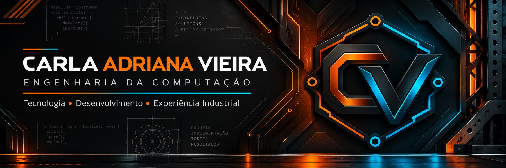

<div align="center">



<br/>

### Estudante de Engenharia da Computação | Tecnologia e experiência industrial

Construindo uma nova etapa profissional por meio da programação, do desenvolvimento web e da tecnologia.

</div>

---

## 01 // SOBRE MIM

```javascript
const carla = {
  formacao: "Engenharia da Computação",
  experiencia: "13 anos na indústria automotiva",
  especialidades: [
    "Gestão de fornecedores e demandas críticas",
    "Organização de processos e análise de informações",
    "Integração entre áreas administrativas e técnicas"
  ],
  tecnologias: ["C", "Java", "HTML", "CSS", "JavaScript"],
  proposito: "Transformar experiência em soluções por meio da tecnologia"
};
```

Sou estudante de **Engenharia da Computação** e profissional com **13 anos de experiência na Volkswagen / MAN Latin America**, atuando em um ambiente que exige organização, comunicação e agilidade na solução de problemas.

Minha trajetória profissional inclui contato com fornecedores, acompanhamento de casos críticos, análise de demandas e interação com áreas como Qualidade e Engenharia. Essa experiência fortaleceu minha capacidade de trabalhar com responsabilidade, definir prioridades e buscar soluções mesmo em situações de pressão.

Atualmente, estou ampliando minha atuação para a área de tecnologia por meio de projetos em **C, Java e desenvolvimento web**. Meu objetivo é unir o conhecimento adquirido na indústria à formação em Engenharia da Computação, criando soluções úteis, bem estruturadas e voltadas às necessidades reais de pessoas e negócios.

---

## 02 // TECNOLOGIAS E FERRAMENTAS

<div align="center">


</div>

---

## 03 // PROJETOS

### 🛠️ RC² InfoCell

Site criado para uma assistência técnica de informática e celulares, reunindo apresentação de serviços, catálogo, promoções, avaliações, localização, carrinho e atendimento ao cliente.

**Tecnologias:** HTML, CSS e JavaScript.

### 💻 Exercícios de programação em C

Atividades acadêmicas envolvendo:

- Estruturas condicionais;
- Laços de repetição;
- Cálculos de média;
- Contagens e validações;
- Entrada e saída de dados.

### ☕ Exercícios de programação em Java

Exercícios com `switch`, classes, métodos, vetores e separação de responsabilidades.

### 🎓 Projetos acadêmicos

Trabalhos relacionados a Interação Humano-Computador, análise de usabilidade, representação gráfica e desenvolvimento de soluções tecnológicas.

> Os códigos e demonstrações serão adicionados conforme cada projeto for revisado e organizado.

---

## 04 // EXPERIÊNCIA QUE LEVO PARA A TECNOLOGIA

- Comunicação com fornecedores e diferentes áreas;
- Acompanhamento de casos críticos;
- Organização de informações e prioridades;
- Experiência com SAP, Oracle e Microsoft Office;
- Responsabilidade, análise e trabalho em equipe.

---

## 05 // OBJETIVO PROFISSIONAL

Busco oportunidades que conectem **tecnologia, organização e experiência industrial**, permitindo aplicar minha formação em Engenharia da Computação e continuar evoluindo em desenvolvimento de software.

---

<div align="center">

### Obrigada por visitar meu portfólio!

`Código, aprendizado e evolução constante.`

</div>
